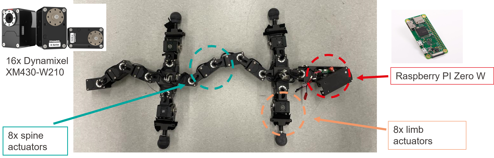
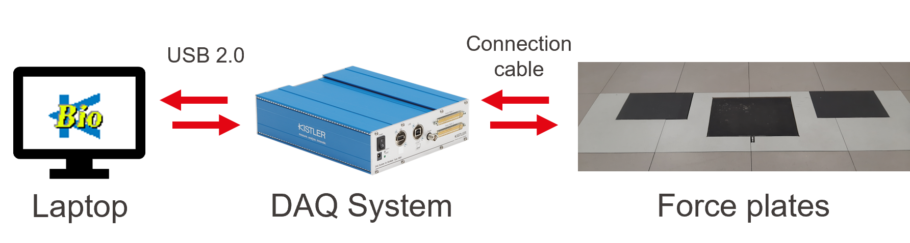
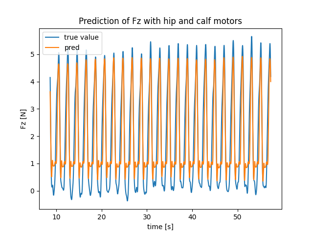
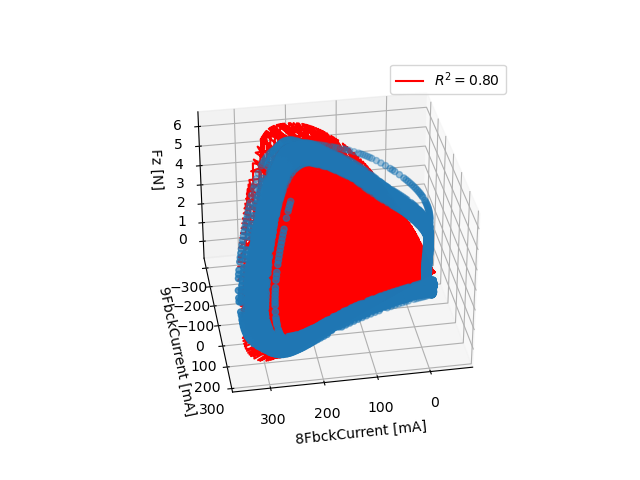
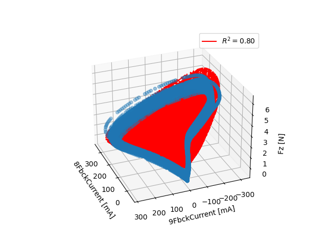

# Polymander Ground Reaction Force Estimation

Polymander is a salamander-inspired amphibious robot developed at EPFL's BioRob lab, able to both walk and swim.


*Demonstration of the Polymander robot walking over force plate. The force estimator was trained using controlled stepping-in-place experiments on the force plate.*

## Motivation
In case of real world scenario such as disaster recovery, legged robots can navigate in challenging and complex environments where wheeled robots may struggle. To achieve stable locomotion, robots rely on sensory information like **ground reaction force (GRF)**, commonly measured with dedicated force/torque sensors mounted on their feet. However, these additional sensors increase hardware complexity, weight, and cost, while potentially reducing reliability and durability of the robot due to repeated impact forces during locomotion.

Can GRFs be estimated directly from **motor current measurements** instead, without a dedicated force sensor?

Using synchronized motor current and force-plate recordings, this pipeline filters and aligns the two signals, then trains a regression model to predict vertical GRF (Fz) from current alone, removing the need for a dedicated force sensor at inference time.

**Software:** Python · NumPy · pandas · SciPy · scikit-learn · Signal Processing · Multiple Linear Regression

**Hardware:** Raspberry Pi Zero W · Dynamixel Actuators · Kistler Force Plate

## Experimental Setup

Experiments were conducted on the **Polymander** quadruped robot, equipped with **16 Dynamixel actuators** and controlled by a **Raspberry Pi Zero W**. Two independent systems recorded data simultaneously during each trial:

- **Motor currents:** logged on-board via the Raspberry Pi Zero W as the robot walked.
- **Ground reaction forces:** measured by a **Kistler force plate**, serving as ground truth.



*Polymander quadruped robot.*



*Experimental setup for recording ground reaction forces.*

Motor control and data logging rely on a C++ controller running locally on the robot's Raspberry Pi Zero W, originally developed by **Laura Paez**. I extended the controller to implement the stepping sequence, and the initial-posture logic that starts the test limb pre-lifted off the ground. These extensions were used to generate the motor feedback logs used in this project. The controller itself is not included in this repo (lab-owned).

The two data streams (motor currents and force plate measurement) were recorded at different sampling rates and synchronized during post-processing.

## Dataset

**Training dataset — 45 trials.** Front left limb was stepped in place across every combination of 3 amplitudes and 3 frequencies, repeated 5 times each. This dataset was used both to study how model performance varies by condition (`evaluate_amplitude_effect.py`, `evaluate_frequency_effect.py`, `evaluate_amp_freq_grid.py`) and to train one generalized model across all conditions pooled together (`train_force_estimator.py`).

**Testing dataset — 9 trials.** Recorded separately afterward, one trial per amplitude/frequency combination, used exclusively to test the generalized model on data it never saw during training (`evaluate_generalized_model.py`).

> Stepping in place (rather than full walking) was necessary because walking only produced one step on the force plate per trial (not enough data per trial to train on).

## Pipeline

The workflow consisted of four stages:
1. Raw signal acquisition
2. Filtering and synchronization
3. Regression model training
4. Vertical ground reaction force estimation

## Key results

RMSE = 0.99N ± 0.14N evaluated on testing dataset (0-6N force range)

Combining hip and calf motor currents produced the most accurate force estimates. The calf actuator (pitch movement -> related to the Fz force) is the stronger predictor; combining both gives the best result.



*Measured vs. Predicted Ground Reaction Force for one trial*

|First view | Second view | Third view|
|---|---|---|
 | | 

*Three views of the fitted multiple linear regression plane relating hip and calf motor currents to the measured vertical ground reaction force.*

**Limitations**
- Linear regression cannot capture all nonlinear actuator dynamics, which shows up as residual error (RMSE ≈ 1N on a 0-6N range).
- Experiments were limited to stepping in place with a single limb. Full walking gait was not investigated because each trial produced only one step on the force plate, providing insufficient data for model training.

## Repository Structure

```text
polymander-grf-estimation/
├── assets/
│   ├── images/
│   └── videos/
├── data/                    # not included - lab-owned experimental data
├── models/                  # trained regression model (.pkl)
├── notebooks/               # exploratory analysis and visualization
├── polymander/              # loaders, signal processing, visualization
├── results/                 # not included - output figures
├── scripts/                 # training and evaluation scripts
├── pyproject.toml
├── README.md
└── requirements.txt
```

## Getting Started
If you've ever inherited a project with no setup instructions and burned an afternoon on a version mismatch, this section is for you.

### Installation

Clone the repo and setup a conda environment:

```bash
git clone https://github.com/inalbon/polymander-grf-estimation.git
cd polymander-grf-estimation
conda create -n polymander python=3.10
conda activate polymander
```

Install dependencies and the local package:

```bash
pip install -r requirements.txt
pip install -e .
```

### Running
```bash
  python scripts/train_force_estimator.py
```

> Note: `scripts/` and `notebooks/` expect the original experimental data, which isn't included in this repo (lab-owned).

## Authors & Acknowledgements

**Malika In-Albon**

Semester project (10 ECTS, Fall 2022) at the **Biorobotics Laboratory (BioRob)** supervised by **Astha Gupta**, under **Prof. Auke Ijspeert**.
