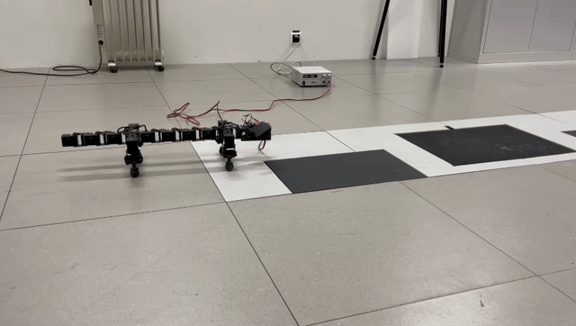
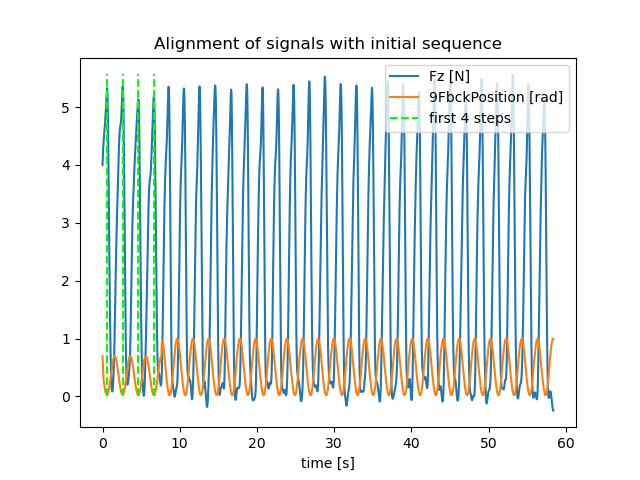
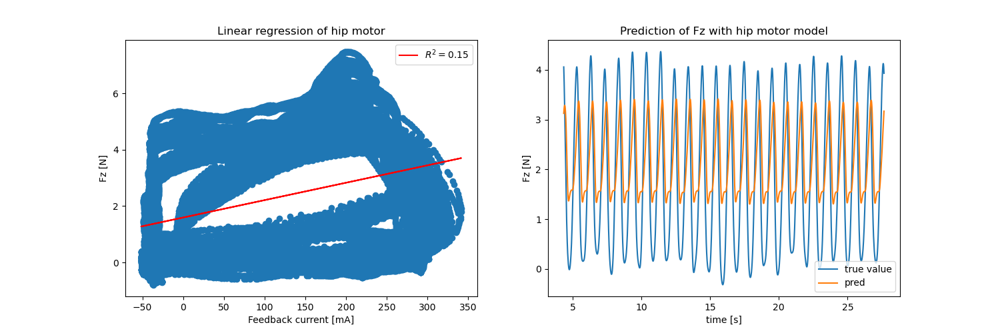
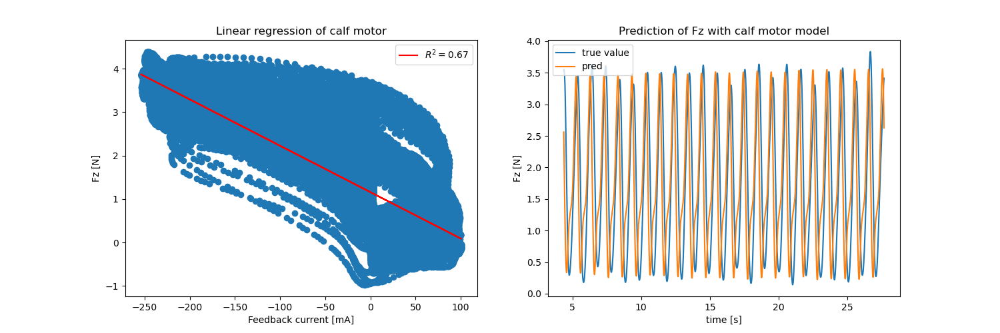
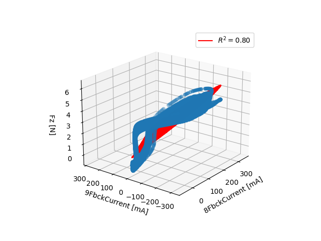
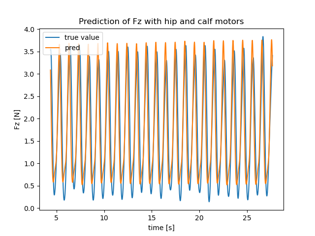

# Current-Based Contact Force Estimation for a Quadruped Robot


*Demonstration of the Polymander quadruped robot walking over force plates while motor currents and ground reaction forces are recorded.*

▶️ **Full demonstration:** [docs/videos/walking-polymander.mp4](docs/videos/walking-polymander.mp4)

This project investigates whether **ground reaction forces (GRFs)** can be estimated directly from **motor current measurements**, reducing the need for dedicated force sensors on legged robots.

**Technologies:**  Embedded Systems · Python · Signal Processing · Feature Engineering · Supervised Learning · Linear Regression · Multiple Linear Regression · Raspberry Pi · Dynamixel Actuators


## Context

- **EPFL** — Semester Project, Fall 2022
- **Laboratory:** Biorobotics Laboratory (BioRob)
- **Supervisor:** Astha Gupta
- **Professor:** Prof. Auke Ijspeert
- Individual project completed over one semester

## My Role

This was an individual project. I was responsible for the complete workflow, including:

- Experimental design
- Data acquisition
- Signal synchronization and preprocessing
- Feature engineering
- Regression model development and evaluation
- Result analysis and documentation

## Motivation
Ground reaction forces are fundamental for balance, gait analysis and locomotion control.

Most quadruped robots estimate these forces using dedicated force sensors, which increase hardware complexity and cost.

The objective of this project was to investigate whether the robot's **motor feedback currents alone** contain enough information to estimate the vertical contact force (**Fz**).

## Experimental Setup

The experiments were conducted using the **Polymander** quadruped robot, equipped with **16 Dynamixel actuators** and controlled by a **Raspberry Pi Zero**. During each trial, motor feedback currents were recorded while the robot walked over **Kistler force plates**, which measured the ground reaction forces.


*Polymander quadruped robot.*

---


*Experimental setup for recording ground reaction forces.*

The two data streams were synchronized during post-processing using an initial gait sequence.

---

# Methodology

The complete workflow consisted of four stages:


1. Record synchronized motor current and force plate signals.
2. Preprocess and align the signals.
3. Extract meaningful features from actuator currents.
4. Train regression models to estimate the vertical ground reaction force.


## Signal Synchronization

Motor currents and force plate measurements were acquired at different sampling rates and required synchronization before modelling.

The initial gait sequence was used as a temporal reference for aligning both signals.



## Model comparison
Three regression models were evaluated to determine which actuator signals best predict the vertical ground reaction force.

| Model | Observation |
|--------|-------------|
| Hip motor current | Weak predictor of contact force. |
| Calf motor current | Significantly stronger correlation with ground reaction force. |
| Hip + calf motor currents | Best overall prediction accuracy by combining complementary information. |

The stronger performance of the calf actuator is expected since it is mechanically closer to the foot-ground contact point.

## Results

### Hip motor only

- Weak correlation with vertical force
- **R² ≈ 0.15**



---

### Calf motor only

- Strong correlation with vertical force
- **R² ≈ 0.67**



---

### Multiple Linear Regression
- Strong correlation with vertical force
- **R² ≈ 0.8**

Combining hip and calf motor currents produced the most accurate force estimates.

|First view | Second view | Third view|
|---|---|---|
 | | 

*Three views of the fitted multiple linear regression plane relating hip and calf motor currents to the measured vertical ground reaction force.*



The predicted force closely follows the measured force plate signal throughout the gait cycle.

---

## Key Results

- Successfully estimated ground reaction forces using motor feedback currents.
- Demonstrated that actuator location strongly influences predictive power.
- Improved prediction accuracy by combining multiple motor currents.
- Developed a complete experimental and data-processing pipeline from acquisition to model evaluation.

---

## Limitations

- Linear regression cannot capture all nonlinear actuator dynamics.
- Experiments were performed on a single gait and controlled laboratory setup.
- Performance depends on accurate signal synchronization.

---

## Repository Structure

```text
Current-Based-Contact-Estimation/
├── src/
├── notebooks/
├── data/
├── docs/
│   ├── images/
│   ├── videos/
│   └── report/
└── README.md
```

---

## Getting Started

### Requirements

- Python 3
- NumPy
- Pandas
- Matplotlib
- Scikit-learn
- Jupyter Notebook

Clone the repository and install the required dependencies before running the notebooks or Python scripts.


---

## Key Takeaways

- Designed an end-to-end robotics experiment.
- Synchronized heterogeneous sensor data.
- Applied signal processing and feature engineering.
- Compared regression models for force estimation.
- Evaluated model performance using experimental data.

---

## Authors & Acknowledgements

**Malika In-Albon**

Semester project conducted at the **EPFL Biorobotics Laboratory (BioRob)** under the supervision of **Astha Gupta**, as part of the Master's programme in Robotics.

## Project Report

📄 The complete report is available in:

`docs/report/current_based_contact_estimation.pdf`

